```r
knitr::opts_chunk$set(warning = FALSE)
```


```r
library(ggplot2)
```

## **1. The data**

We check the present directory for the files that are present and then we will import the **datasets**.


```r
dir()
```

```
##  [1] "figure"                       "README.md"                    "sea-level.csv"               
##  [4] "sea-level_fig-1.csv"          "sea_data.csv"                 "sea_data1.csv"               
##  [7] "sea_level_coastal_area.html"  "sea_level_coastal_area.md"    "sea_level_coastal_area.Rmd"  
## [10] "Sea_Level_Coastal_Area.Rproj" "slr-impacts_nov2010.xls"
```

Now we import the **datasets** that will be required for this problem and store them in 2 variables, **sea_data** and **sea_level**


```r
sea_data <- read.csv("sea_data.csv")
sea_level <- read.csv("sea-level.csv")
```

We take a look at the summary of the 2 datasets:


```r
str(sea_data)
```

```
## 'data.frame':	84 obs. of  14 variables:
##  $ Code                       : Factor w/ 84 levels "AGO","ARE","ARG",..: 3 6 7 8 10 16 17 18 20 22 ...
##  $ Region                     : Factor w/ 5 levels "East Asia","Latin America/Caribbean",..: 2 2 2 2 2 2 2 2 2 2 ...
##  $ Country.Name               : Factor w/ 84 levels "Algeria","Angola",..: 3 4 6 8 12 14 17 18 20 21 ...
##  $ Total.Area.sq.m.           : int  2736391 13162 22290 8480395 721229 1141569 51015 111199 48092 246700 ...
##  $ Affected.area.by.1m.rise   : int  9083 1523 424 11456 7266 2405 184 1766 222 922 ...
##  $ Affected.area.by.2m.rise   : int  14331 2507 752 20673 9280 3642 258 3215 362 1387 ...
##  $ Affected.area.by.3m.rise   : int  20131 4080 1089 34564 11249 5335 373 5355 567 2026 ...
##  $ Affected.area.by.4m.rise   : int  25362 6165 1396 43970 12923 7255 544 8163 817 2830 ...
##  $ Affected.area.by.5m.rise   : int  30806 8146 1703 51162 12923 9124 778 11181 1092 3753 ...
##  $ X..affected.area.by.1m.rise: num  0.33 11.57 1.9 0.14 1.01 ...
##  $ X..affected.area.by.2m.rise: num  0.52 19.05 3.37 0.24 1.29 ...
##  $ X..affected.area.by.3m.rise: num  0.74 31 4.89 0.41 1.56 0.47 0.73 4.82 1.18 0.82 ...
##  $ X..affected.area.by.4m.rise: num  0.93 46.84 6.26 0.52 1.79 ...
##  $ X..affected.area.by.5m.rise: num  1.13 61.89 7.64 0.6 1.79 ...
```

```r
str(sea_level)
```

```
## 'data.frame':	135 obs. of  5 variables:
##  $ Year                               : int  1880 1881 1882 1883 1884 1885 1886 1887 1888 1889 ...
##  $ CSIRO...Adjusted.sea.level..inches.: num  0 0.22 -0.441 -0.232 0.591 ...
##  $ CSIRO...Lower.error.bound..inches. : num  -0.953 -0.732 -1.346 -1.13 -0.283 ...
##  $ CSIRO...Upper.error.bound..inches. : num  0.953 1.173 0.465 0.665 1.465 ...
##  $ NOAA...Adjusted.sea.level..inches. : num  NA NA NA NA NA NA NA NA NA NA ...
```

## **2.Analysis**

### 2.1 Sea Level dataset:

We will analyse this dataset to check the **general trends** of the **rising sea level**.  

First we change the names of the columns of the **sea_level** dataset.

```r
names(sea_level) <- c("Year", "Sea Level(inches)", "Lower Bound Level", "Upper Bound Level", "Sattelite")
```

Now we make the plots for the **Years** VS **Sea Level**.


```r
s <- ggplot(sea_level, aes(Year, `Sea Level(inches)`+ (`Lower Bound Level`+`Upper Bound Level`)/2))
s + geom_line(color = c("black")) + geom_smooth(linetype = 3, size = 2, color = "blue") + labs(y = "Adjusted Sea Level(incles)", title = "Sea Level Rise VS Year(1880 to 2014)") + theme_classic()
```

```
## `geom_smooth()` using method = 'loess' and formula 'y ~ x'
```

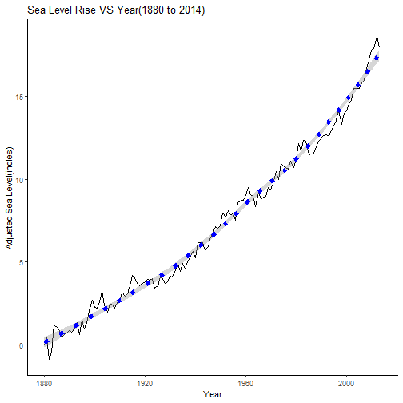

The graph shows us an overall increase in the sea level every year. The **blue regression line** shows a **general increasing trend** in the **sea level** over the **years**, the **grey** area around the line indicates the **95% Confidence Interval**.

### 2.2 Sea and Land dataset:

Now we work with the **sea_data** dataset.

#### **2.2.1 Countries VS Total Land Mass**


```r
sub_sa_af <- subset(sea_data, Region == "Sub Saharan Africa")
not_sub_saharan <- subset(sea_data, Region != "Sub Saharan Africa")
```


```r
dim(sub_sa_af)
```

```
## [1] 29 14
```

```r
dim(not_sub_saharan)
```

```
## [1] 55 14
```

So we have separated all the data for each region in separate variables.
Now we will make plots for each region.


```r
qplot(Total.Area.sq.m., Country.Name, data = sub_sa_af, xlab = "Total Area in sq. meters", main = "Sub Saharan Africa")
```

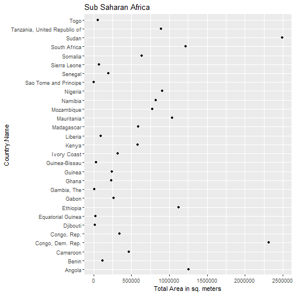

```r
qplot(Total.Area.sq.m., Country.Name, data = not_sub_saharan , xlab = "Total Area in sq. meters", main = "Other Countries as per their region", color = Region)
```

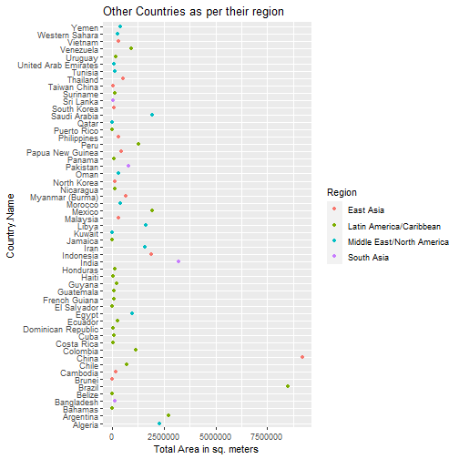

#### **2.2.2 Submerged area with rising sea level**

##### First we see the plots for the **Sub Saharan Africa** region.
**a.What effect does a rise in 1 meter sea level has on the land masses?**

```r
g <- ggplot(sub_sa_af, aes( X..affected.area.by.1m.rise, Country.Name))
g + geom_point() + labs(x = "% of land submerged", y = "Country Name", title = "Land Submerged when Sea level rises by 1m")
```

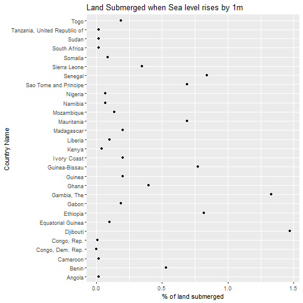

**b.What effect does a rise in 2 meter sea level has on the land masses?**

```r
g <- ggplot(sub_sa_af, aes( X..affected.area.by.2m.rise, Country.Name))
g + geom_point() + labs(x = "% of land submerged", y = "Country Name", title = "Land Submerged when Sea level rises by 2m")
```

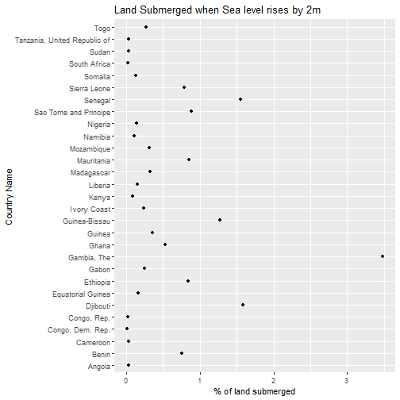

**c.What effect does a rise in 3 meter sea level has on the land masses?**

```r
g <- ggplot(sub_sa_af, aes( X..affected.area.by.3m.rise, Country.Name))
g + geom_point() + labs(x = "% of land submerged", y = "Country Name", title = "Land Submerged when Sea level rises by 3m")
```


**d.What effect does a rise in 4 meter sea level has on the land masses?**

```r
g <- ggplot(sub_sa_af, aes( X..affected.area.by.4m.rise, Country.Name))
g + geom_point() + labs(x = "% of land submerged", y = "Country Name", title = "Land Submerged when Sea level rises by 4m")
```


**e.What effect does a rise in 5 meter sea level has on the land masses?**

```r
g <- ggplot(sub_sa_af, aes( X..affected.area.by.5m.rise, Country.Name))
g + geom_point() + labs(x = "% of land submerged", y = "Country Name", title = "Land Submerged when Sea level rises by 5m")
```

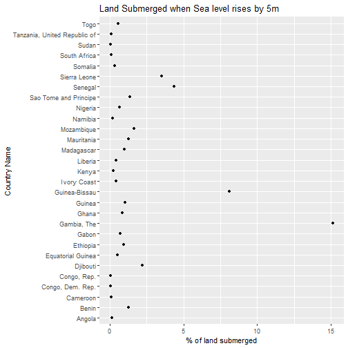

##### Now we see the plots for the **countries other than the Sub Saharan Africa** region.
**a.What effect does a rise in 1 meter sea level has on the land masses?**

```r
g <- ggplot(not_sub_saharan, aes( X..affected.area.by.1m.rise, Country.Name, color = Region))
g + geom_point() + labs(x = "% of land submerged", y = "Country Name", title = "Land Submerged when Sea level rises by 1m")
```

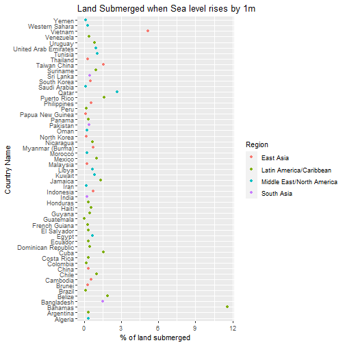

**b.What effect does a rise in 2 meter sea level has on the land masses?**

```r
g <- ggplot(not_sub_saharan, aes( X..affected.area.by.2m.rise, Country.Name, color = Region))
g + geom_point() + labs(x = "% of land submerged",y = "Country Name", title = "Land Submerged when Sea level rises by 2m")
```

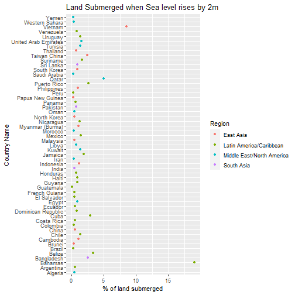

**c.What effect does a rise in 3 meter sea level has on the land masses?**

```r
g <- ggplot(not_sub_saharan, aes( X..affected.area.by.3m.rise, Country.Name, color = Region))
g + geom_point() + labs(x = "% of land submerged", y = "Country Name", title = "Land Submerged when Sea level rises by 3m")
```

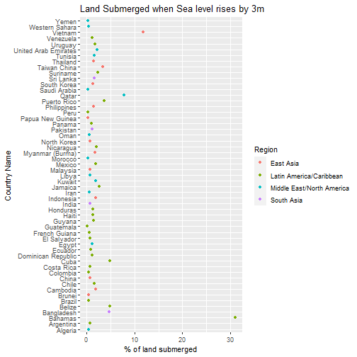

**d.What effect does a rise in 4 meter sea level has on the land masses?**

```r
g <- ggplot(not_sub_saharan, aes( X..affected.area.by.4m.rise, Country.Name, color = Region))
g + geom_point() + labs(x = "% of land submerged", y = "Country Name", title = "Land Submerged when Sea level rises by 4m")
```

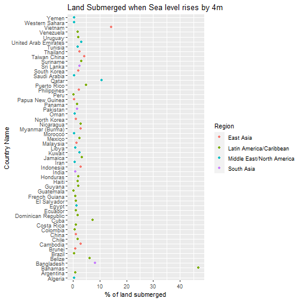

**e.What effect does a rise in 5 meter sea level has on the land masses?**

```r
g <- ggplot(not_sub_saharan, aes( X..affected.area.by.5m.rise, Country.Name, color = Region))
g + geom_point() + labs(x = "% of land submerged", y = "Country Name", title = "Land Submerged when Sea level rises by 5m")
```

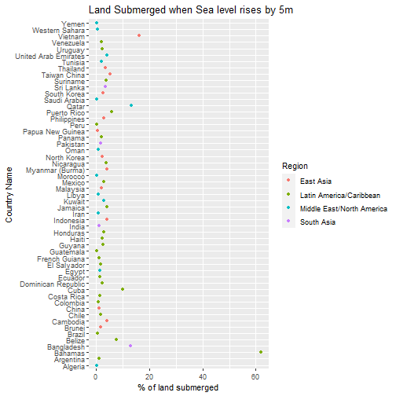


## **3. Work Flow**

a. An **Exploratory Analysis** on the provided dataset was done.  
b. The main aim of the Analysis was to **understand the effects of rising sea level on the land masses**.  
c. We import the 2 datasets and do a bit of **pre processing**  
d. The first data set shows the **globally rising sea level**.  
e. We then look at the **total area of land masses in each country**. The countries were splitted into 2 sections **because plotting all the countries in one data set would have made the plot very clumsy!!**  
f. Now, we make **5 different plots** for **Sub Saharan Africa** countries and the **area that will be submerged** if the **sea level rises by 1, 2, 3, 4, 5 meters**  
g. Now, we make **5 different plots** for **non - Sub Saharan Africa** countries and the **area that will be submerged** if the **sea level rises by 1, 2, 3, 4, 5 meters**  

## **4. Conclusion**

a. In the first plot we obsereve that the **global sea level is rising**. This is shown by the **blue regression line**.  
b. The same plot also demonstrates the **nature of increasing sea level is exponential**.  
c. The plots related to the **Land % submerged VS sea level** depicts a picture in front of us about the effect a rising sea level is going to have on the land masses.  
d. The plots for **other countries are splitted as per the Regions**, for an overview of the **% of land that will be under water if the sea level rises by X%**  
e. The Analysis was effected because, even after a lot of internet browsing, **an appropriate all in one data set was not found!!**  
f. Sites like **GitHub** and **Kaggle** were browsed to find a suitable dataset!!  
